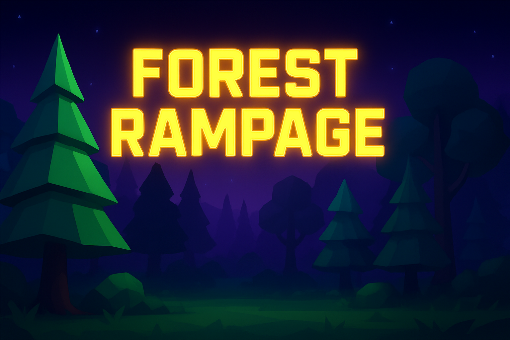

<h1 align="center">Forest Rampage</h1>

**Created by Antoine Venturelli** – original idea and development by me.

Forest Rampage is a simple **3D low-poly game** where you control a **crazy car** and try to **destroy as many trees as possible**. The game is still in development, with new features coming soon, so stay tuned!

---

## Démo
Vous pouvez jouer/tester le jeu ici : [Forest Rampage](https://antoineven.github.io/forest-rampage/)

⚠️ **Note:** The game is currently a prototype.

---

## Current features
- Playable low-poly 3D car
- Score system and tree counter
- Trees and car explosions
- Few particles
- Main menu, Pause, Game over menu
- Turbo Boost Bonus

## Coming soon
- Bonuses of all kinds
- Enemies and obstacles
- Enhanced gameplay, physics, and visuals

---

## Controls / Commandes
Here are the current controls to play the game:

| Action              | Key / Button |
|---------------------|--------------|
| Move forward        | Z            |
| Move backward       | S            |
| Turn left           | Q            |
| Turn right          | D            |
| Pause               | Escape       |
| Shoot / Action      | Space   _⚠️Not yet available_    |

---

💡 Test it, follow the project, and share your feedback!
